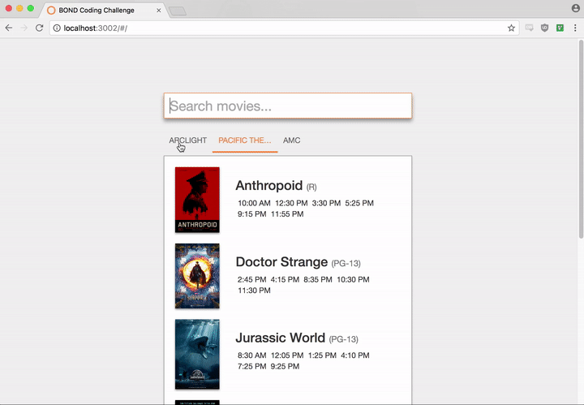
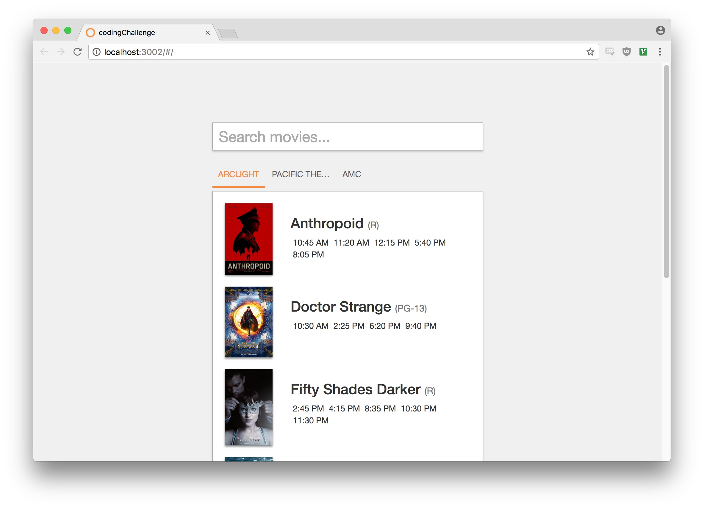
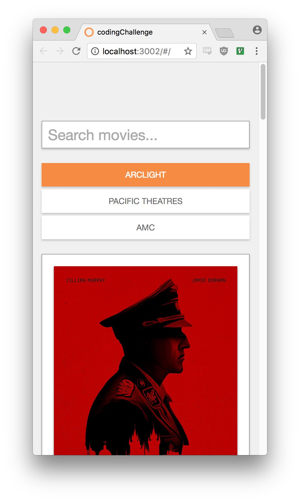
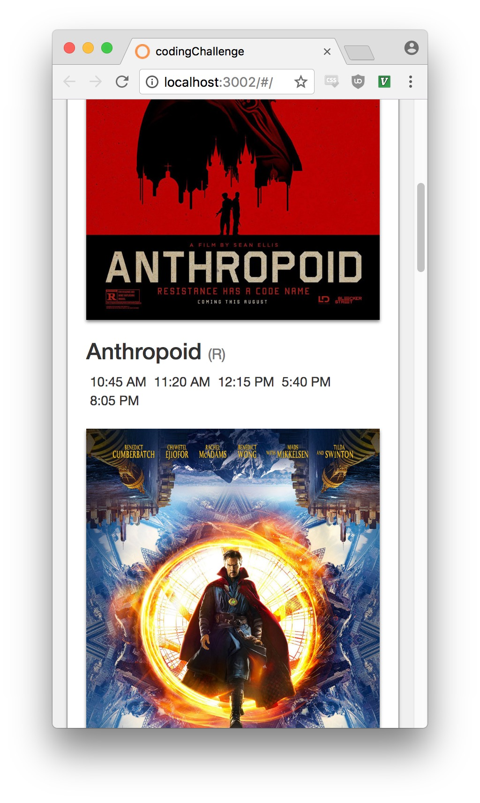

# BOND Coding Challenge
## Introduction

Welcome to the BOND Coding Challenge.

Please set aside **no more than two hours** to complete this exercise. Get as far as you can, but you’re not required to complete the task! The purpose of this exercise is to get a feel for your approach to problem solving, code style, and comfort with different aspects of developing for the web.

If you have any questions or get stuck on something (including setup), don't hesitate to send us an email at matt@wearebond.com. Good luck!

## Movie Showtimes App

Build an interactive, responsive movie showtimes app as shown in the mock images.

### Instructions

- Use the JSON files inside `data/` to drive the results
- Use any frontend framework/library/build tool you are comfortable with, designing the app for the possibility of expanding features
- Include your `bower.json`, `gulpfile.js`, `package.json`, etc if/as necessary
- Using the mock images as reference, match styles as closely as possible
- Responsive Behavior: Make sure the app gracefully scales down to a mobile view

### Assumptions you can make

- API (`theater_showtimes.json` and `movie_metadata.json`) gives you showtimes for "today"
- You own the datasource, feel free to manipulate the JSON files' format (but show why if you felt the need to do so)

### Optional/Bonus

If you find yourself with time to spare, feel free to improve functionality as you see fit (by no means required). We've outlined some of our ideas below:

- Sort movies by title
- Sort showtimes by date/time
- CSS "Fade" showtimes that have already passed
- Filter by rating (G, PG-13, R)

## Submit Your App

Zip project directory and send it our way: [matt@wearebond.com](mailto:matt@wearebond.com)

Assume we will install and run any dependency/build process necessary, so make sure to include relevant files.

### Thanks!

We really appreciate you taking the time for this challenge.

**All copyrights belong to their respective owners.**

